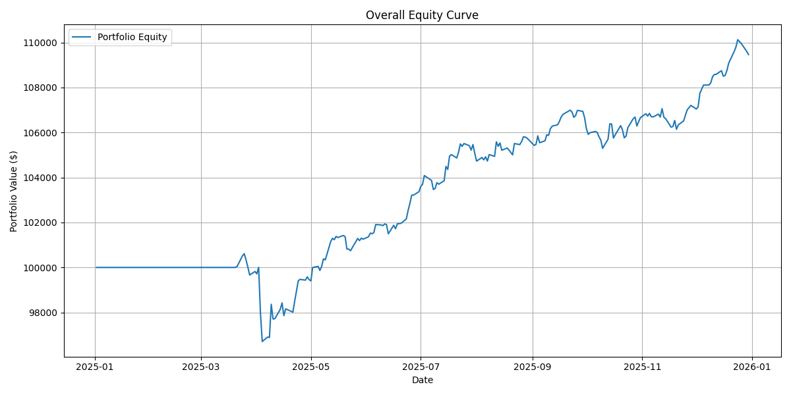
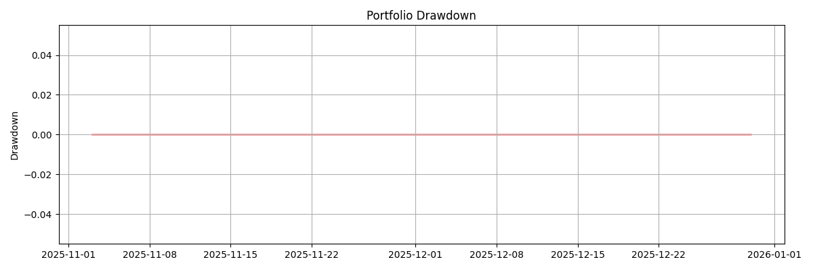

# Quantitative Portfolio Report
**Date:** 2026-05-15  
**Portfolio Evaluated:** Global Multi-Asset Growth Portfolio — Equal Weight  
**Tickers Included:** AAPL, MSFT, GOOGL, BAC

---

## 1️⃣ Key Metrics

| Metric          | Value                          |
| --------------- | ------------------------------ |
| CAGR            | 30.53%                       |
| Sharpe Ratio    | 1.23                     |
| Max Drawdown    | -25.79%               |
| Volatility      | 20.31%                 |
| Analysis Period | 2024-03-28 to 2025-12-30 |

*These metrics summarize the overall performance and risk profile of the recommended portfolio.*

---

## 2️⃣ Portfolio Composition

| Ticker | Weight |
|--------|--------|
| AAPL | 25.0% |
| MSFT | 25.0% |
| GOOGL | 25.0% |
| BAC | 25.0% |

*Weights can be adjusted based on client preferences or risk tolerance.*

---

## 3️⃣ Portfolio Analysis

### Equity Curve

### Drawdown

---

## 4️⃣ Individual Ticker Insights

## AAPL

## MSFT

## GOOGL

## BAC

*Each ticker section shows the relevant charts, features, or performance metrics.*

---

## 5️⃣ Recommendation

> Based on the metrics above, we recommend this portfolio for a **moderately aggressive investor**.  
> - Expected annual return (CAGR): 30.53%  
> - Risk-adjusted return (Sharpe): 1.23  
> - Maximum historical loss (Max Drawdown): -25.79%  
> - Annualized Volatility: 20.31%

*Alternative scenarios (e.g., max Sharpe portfolio or min volatility portfolio) can be provided if desired.*

---

## 6️⃣ Data Sources

- Portfolio historical data: internal calculations / CSV files  
- Economic indicators: CPIAUCSL or other relevant sources  
- Plots generated from latest data analysis