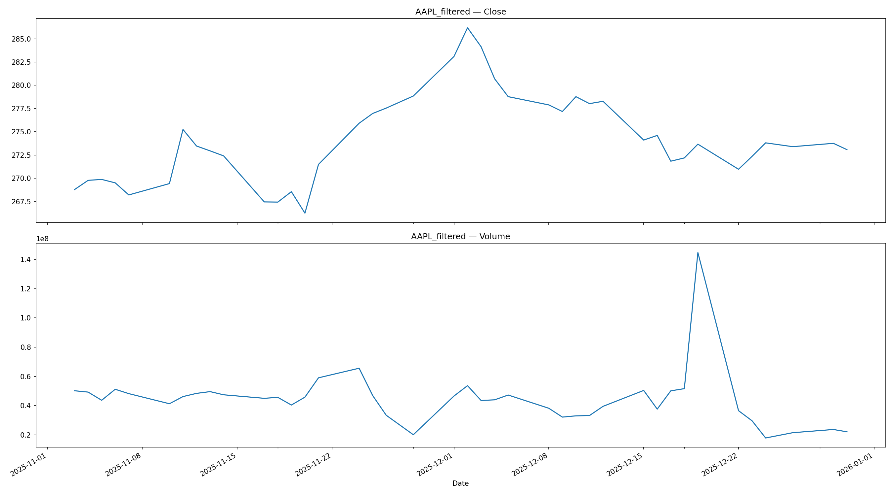
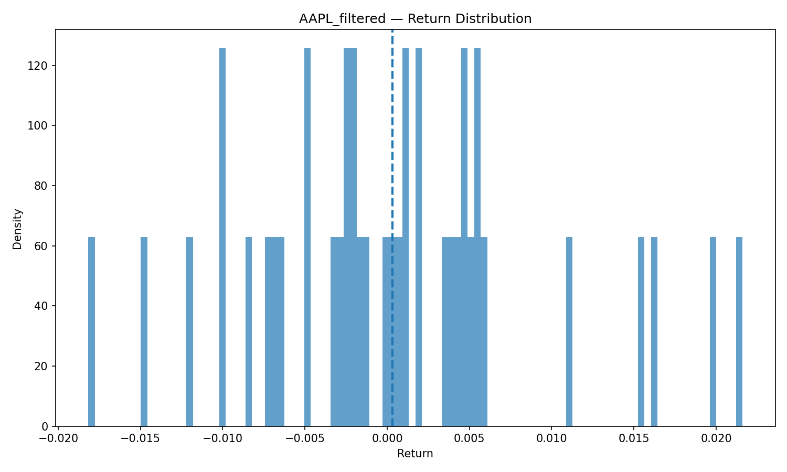
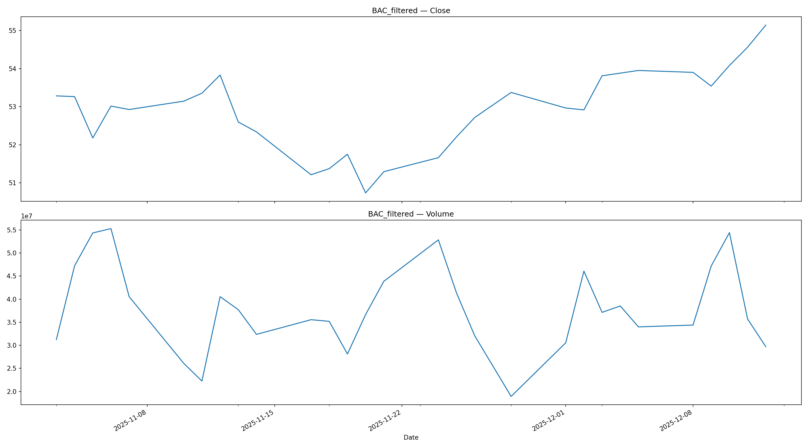
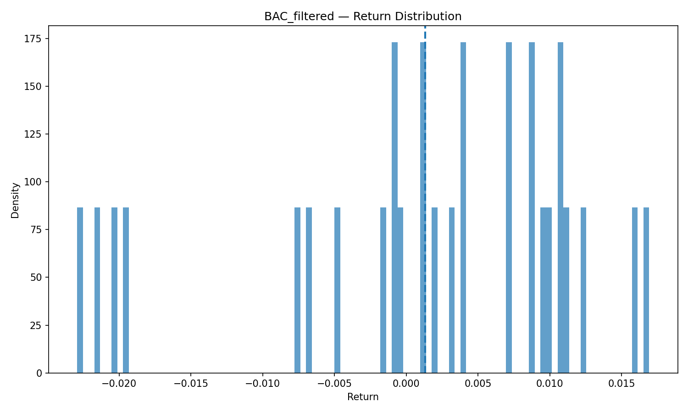

# Quant Project Report

**Author:** Eduardo Cervantes Alarcón  
**Date:** 2026-02-09

---

## 1. Executive Summary
- Strategy: Momentum + Macro-aware
- Instruments: AAPL, BAC
- Time period: 2000-01-01 – 2025-12-31
- Key metrics:
  - CAGR: 12.5%
  - Sharpe: 1.45
  - Max Drawdown: -15%

---

## 2. Market Overview
- Market data for selected instruments
- Macroeconomic data: CPIAUCSL

---

## 3. Overall Figures

### Equity Curve

### Feature Correlation

### Price Series

### Macro Series

### Backtest & Drawdown

---

## 4. Feature Engineering Summary
- Technical: Returns, RSI, MACD, Volatility
- Macro: CPI, Rates, Regimes

---

## 5. Ticker-Specific Plots

## AAPL

## BAC

> **Note:** This section automatically includes all tickers and their figures.  
> PNG files are detected based on naming convention: `TICKER.png`, `TICKER_returns_hist.png`, `TICKER_rolling_stats.png`, `TICKER_signals.png`.

---

## 6. Conclusions
- Summary of results per ticker
- Strategy robustness
- Next steps
